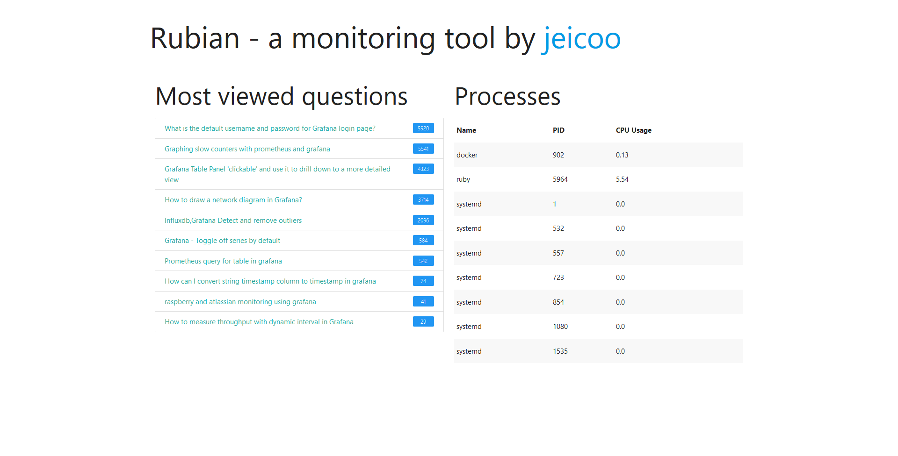

# rubian
a monitoring tool based on Ruby



## Getting started

From the applications root directory, run the following commands

1. Install the dependencies using bundler. If you don't have bundler yet, see https://github.com/bundler/bundler on how to install.
	```bash
	$ bundle install
	```

2. Run the application
	```bash
	$ ruby application.rb
	```

3. Open http://localhost:4567  in your browser
